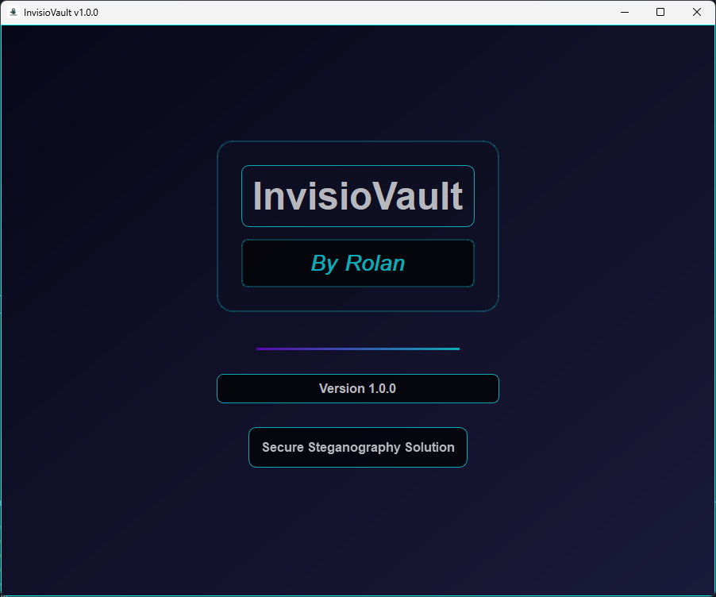
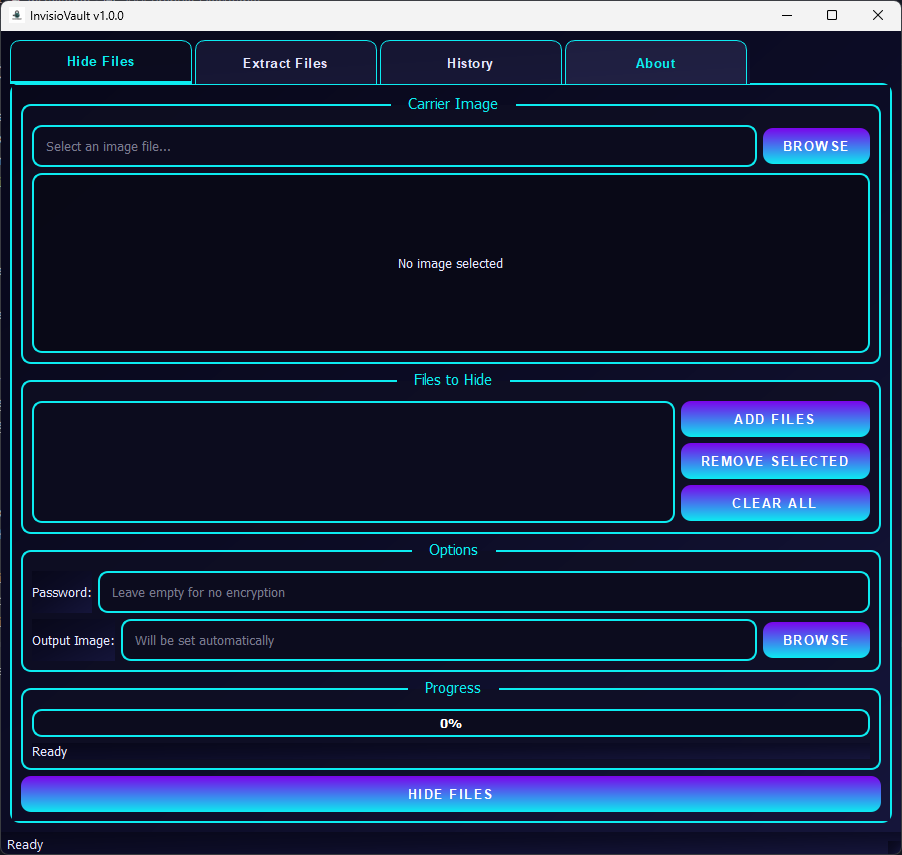
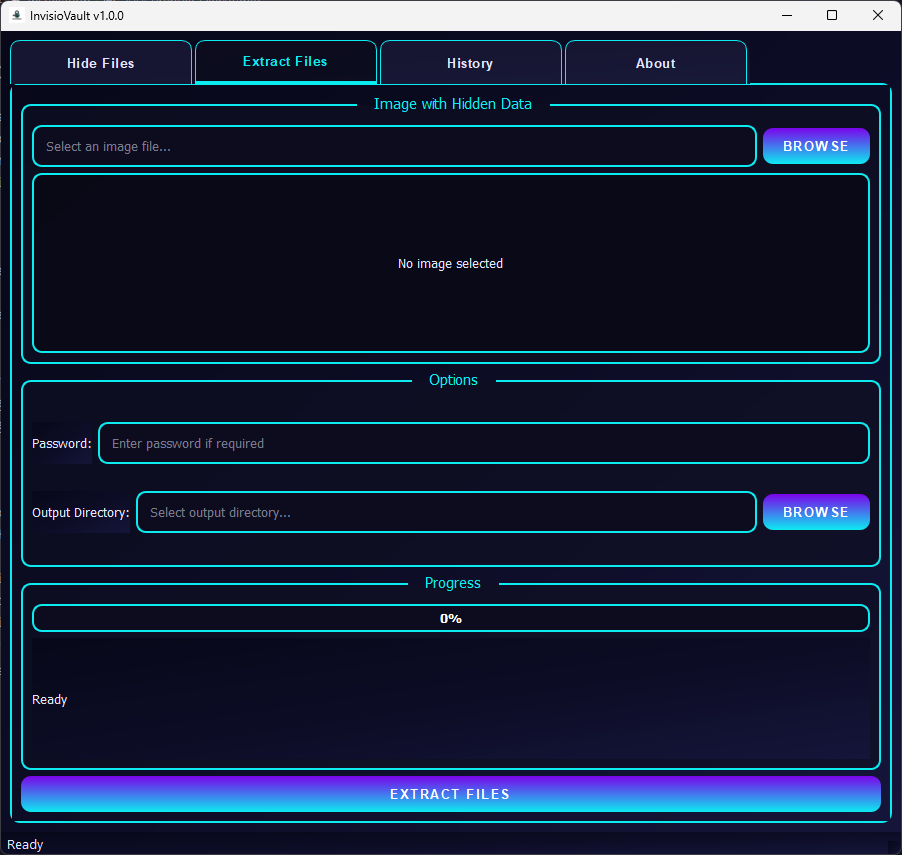
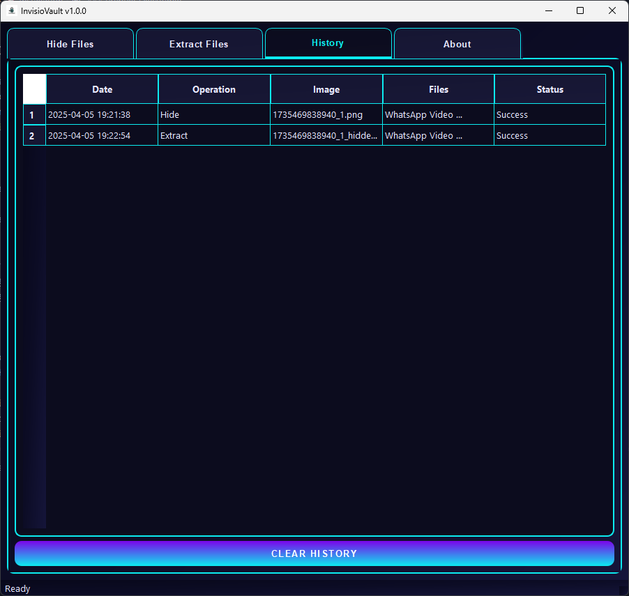
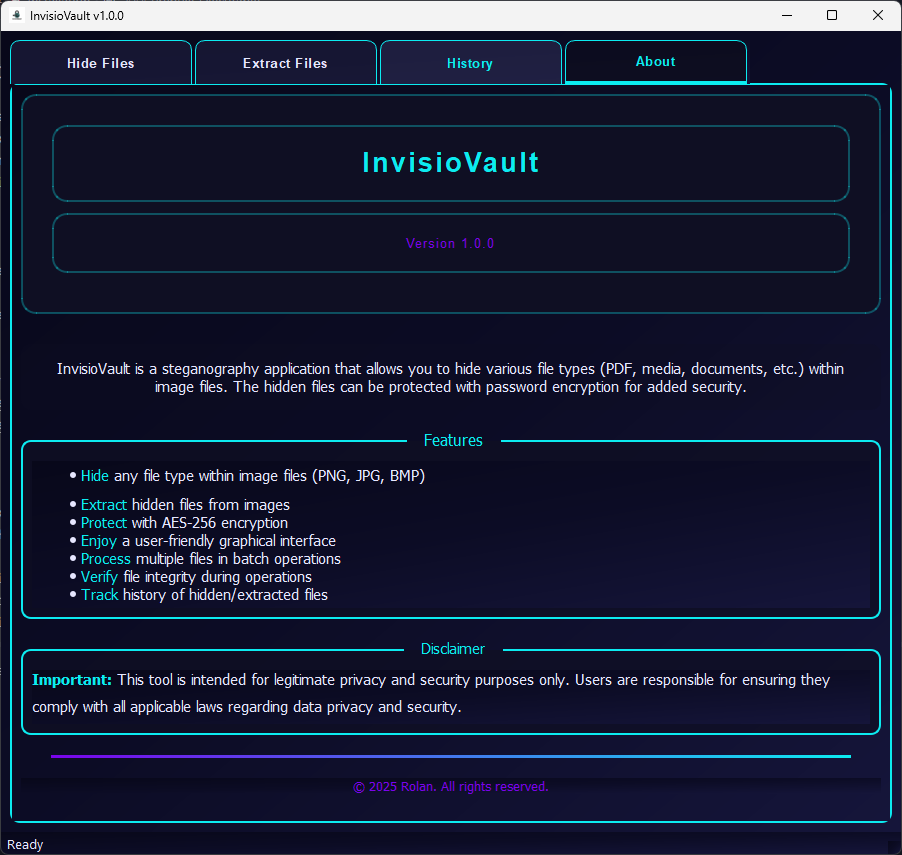

<div align="center">
  
  <h1>InvisioVault</h1>
</div>

# InvisioVault

## 📋 Table of Contents
- [Features](#-features)
- [Installation](#-installation)
- [Usage](#-usage)
- [Building from Source](#-building-from-source)
- [Security](#-security)
- [Contributing](#-contributing)


InvisioVault is a professional steganography application that securely hides various file types (PDF, media, documents, etc.) within image files using AES-256 encryption. Perfect for discreet data storage and privacy-conscious users.

## ✨ Features

- 📁 **Multi-Format Support** - Hide PDFs, documents, media files, and more
- 🔐 **Military-Grade Encryption** - AES-256 password protection
- 🖼️ **Image Formats** - PNG, JPG, BMP support
- 🔄 **Batch Processing** - Hide/extract multiple files at once
- 📊 **History Tracking** - Detailed operation logs
- ✅ **File Integrity** - Automatic checksum verification
- ⚡ **Quick Setup** - Single executable build

## 🚀 Installation

### Prebuilt Executable
1. Download the latest release from [Releases page]
2. Double-click `InvisioVault.exe` from the `dist` folder

### From Source
```bash
git clone https://github.com/yourusername/InvisioVault.git
cd InvisioVault
pip install -r requirements.txt
python build.bat
```

## Building from Source
1. Install [Python 3.8+](https://python.org)
2. Run `build.bat` to:
   - Install dependencies
   - Create standalone executable
   - Generate application icon
3. Find executable in `dist` folder

## Requirements

- Windows operating system
- Python 3.8 or higher
- Required Python packages (see requirements.txt)

## 📸 Screenshots






## Usage

1. Run the application executable
2. Select an operation (Hide or Extract)
3. For hiding:
   - Select the carrier image
   - Select the file(s) to hide
   - Set a password (optional)
   - Click "Hide Files"
4. For extracting:
   - Select the image containing hidden files
   - Enter the password (if required)
   - Choose extraction location
   - Click "Extract Files"

## Security

InvisioVault uses AES-256 encryption to secure your hidden files. Even if someone discovers that an image contains hidden data, they cannot extract it without the correct password.

## Disclaimer

This tool is intended for legitimate privacy and security purposes only. Users are responsible for ensuring they comply with all applicable laws regarding data privacy and security.
